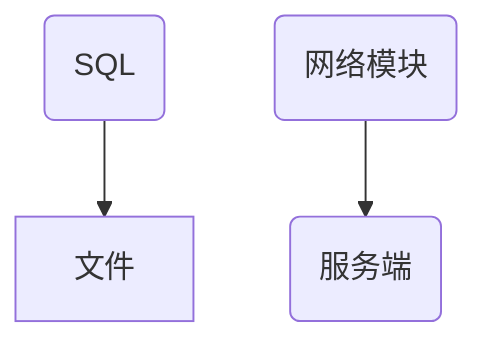
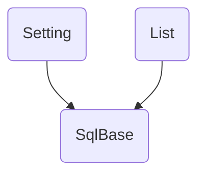

# deltaNote客户端

## 客户端重构架构设计

```mermaid
graph TD
	C(SQL) --> D[文件]
    B(网络模块) -->A(服务端)
    

```

### 数据库重构

```mermaid
graph TD
	C(Setting) --> D(SqlBase)
    B(List) -->D(SqlBase)
    

```

- SqliteBase使用C++类

## 重构规范
重构规范

## 界面重刷
- 自动刷新进程（由定时进程处理）
- 点击历史记录：此时所有编辑窗口都已关闭
- 修改配置之后，列表内容要重绘（登录操作之类的，需要调用一次刷新）
- 