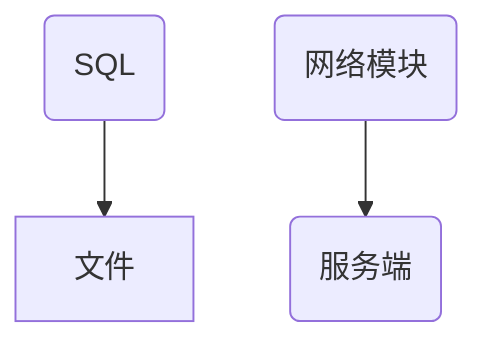
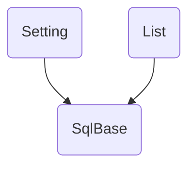

# deltaNote客户端

## 客户端重构架构设计

```mermaid
graph TD
	C(SQL) --> D[文件]
    B(网络模块) -->A(服务端)
    

```

### 数据库重构

```mermaid
graph TD
	C(Setting) --> D(SqlBase)
    B(List) -->D(SqlBase)
    

```

- SqliteBase使用C++类

## 重构规范
