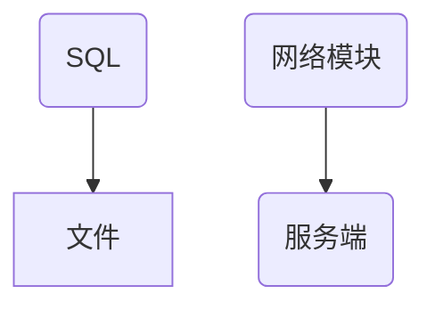
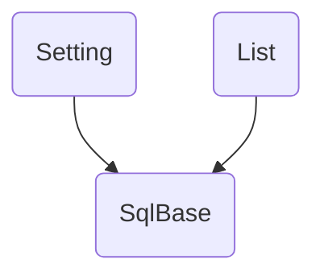

# deltaNote客户端

## 客户端重构架构设计

### 数据库重构

- SqliteBase使用C++类

## 本地列表控制梳理
- 表面上一共有两个列表：已完成和未完成
  - 从已完成移动到未完成
  - 从未完成移动到已完成
  - 清空已完成
  - 未完成列表新增
- 背后有一个操作表：梳理操作流
  - 记录所有的操作
  - 同步时根据操作表的记录进行sync

- 图形层面
  - 一个已完成表
  - 一个未完成表
- 图形层面操作
  - 清空内容
  - 新增
  - 修改

- 每一个小条目
  - 修改：发送信号到主页面
  - 修改：同步本地的值

注意：图形层面和背后逻辑应该分离

## 重构规范
